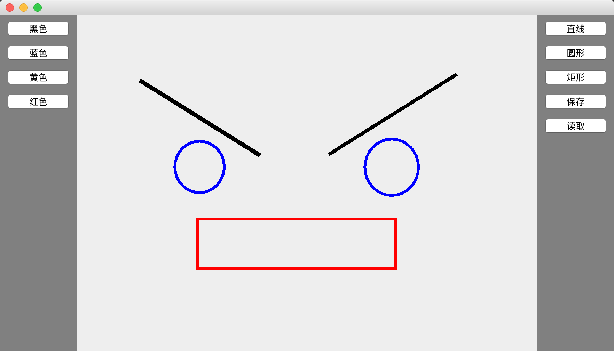

# mini-cad

## 功能

- [x] 放置直线、矩形、圆
- [x] 选中图形
- [x] 修改参数，如颜色
- [x] 拖动图形和调整粗细，选中后按键盘上下键
- [x] 删除，选中后按键盘delete键
- [x] 可以保存和恢复

## Class

### Shape类

Circle类、Line类、Rectangle类的父类抽象，保存各种形状的坐标，同时实现Serializable接口，提供各种图的draw方法等。

### Picture类

view层，提供方法修改ArrayList和重绘。

### Index类

入口，绑定各种键盘，鼠标事件，修改model的ArrayList里的shape的数据。

## demo

